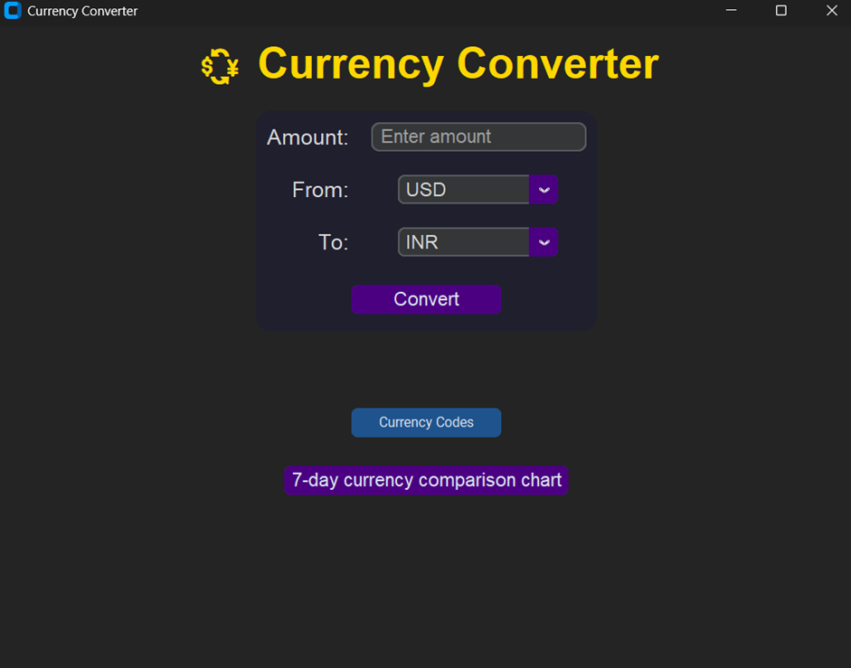
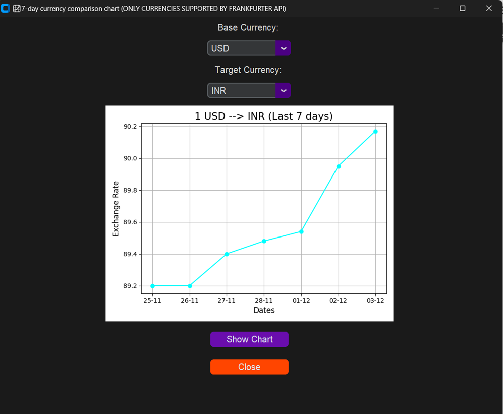

# 🥭 Jackfruit Problem – Currency Converter (Python)

A mini-project that provides an easy-to-use currency converter with a 7-day historical comparison chart using multiple Forex APIs.

---

## 👥 Team Members

| Name | SRN | Class |
|------|------|--------|
| Aarohi Gupta | PES1UG25BT001 | C1 |
| Abhijith B Bharadwaj | PES1UG25EC008 | C1 |
| Aashmeen Kaur | PES1UG25CS010 | C1 |
| Abhiram Vinayak Shanbhag | PES1UG25EC012 | C1 |

🔗 **GitHub Repository:**  
https://github.com/W1se-PyTh0n/Jackfruit-Project

---

## 📌 Problem Statement
**Currency conversion using Forex APIs**

This project aims to create a fast, reliable, and user-friendly application capable of converting currencies across the world and displaying a 7-day comparison chart between any two supported currencies.

---

## 🛠️ Methodology / Approach

### **Step 1 — Importing Modules & APIs**
Modules used:
- `requests` — for API requests  
- `datetime`, `timedelta` — for generating last 7 days  
- `customtkinter` — for GUI  
- `matplotlib.pyplot` — for plotting charts  

APIs used:
- **ExchangeRate API** – for currency conversion (wide support, no historical data)  
- **Frankfurter API** – for 7-day historical exchange data (limited support)

---

### **Step 2 — Currency Code Fetching & Conversion**
Functions were written to:
- Fetch all currency codes and names  
- Convert an amount using base → target currency through API

---

### **Step 3 — Building the GUI**
Using **CustomTkinter**, the app includes:
- Main window  
- Title & frames  
- Buttons  
- Dropdown menus  
- Input boxes for amount / currencies

---

### **Step 4 — User Input**
Users can:
- Enter amount  
- Select or type base currency  
- Select or type target currency  
- Press **Convert** to view the converted value in a new window

---

### **Step 5 — 7-Day Currency Comparison Chart**
- User chooses two currencies  
- A new window opens with a **matplotlib** chart  
- Chart is rendered using `FigureCanvasTkAgg`  
- Logic added to skip holidays to always show **exactly 7 days** of data

---

### **Step 6 — Output Display**
- Converted amount window  
- 7-day comparison chart window  

---

## 📚 Data Structures Used
- **Lists** — store currency codes and daily rate values  
- **Dictionary** — for JSON API responses  
- **Functions** — modular approach (conversion, fetching, plotting)

---

## ⚠️ Challenges Faced
- ExchangeRate API lacked historical data → required Frankfurter API  
- Frankfurter API does not provide holiday data → custom logic to maintain 7 points  
- Different API structures → needed integration logic  

---

## 🚀 Scope for Improvement
- Real-time graph updates  
- Live exchange rate display during conversion  
- Convert base → multiple target currencies at once  
- Add 1-month / 3-month / 6-month / 1-year trend charts  

---

## 🖼️ Sample Outputs  
*(Add images/screenshots as needed in your GitHub repo)*

### **Main Window**  

### **Currency Conversion Result**  

### **Supported Currencies (Conversion)**  

### **7-Day Comparison Chart**  

### **Supported Currencies (Chart)**  

---

## 🧩 Project Purpose
This mini-project demonstrates:
- GUI development using CustomTkinter  
- API consumption  
- Data visualization with Matplotlib  
- Practical modular programming in Python  

---

## 📄 License
This project is for educational purposes.

---

